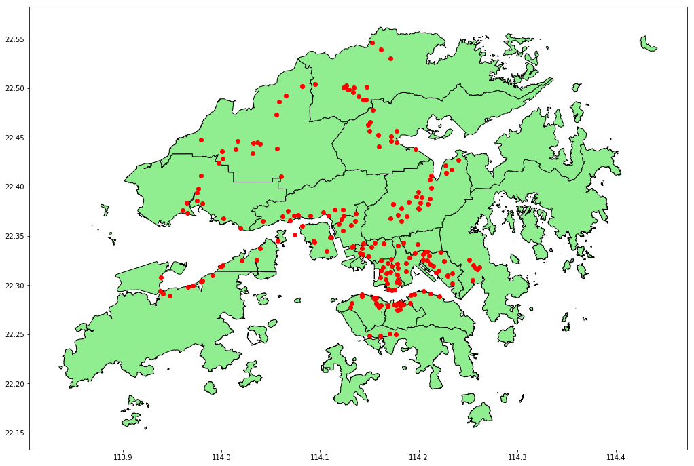
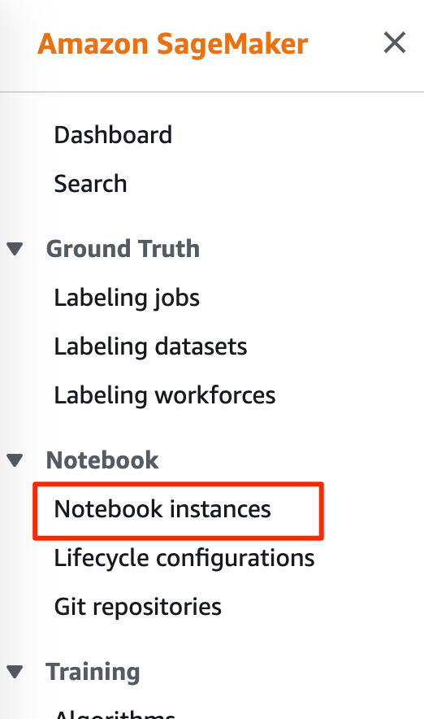
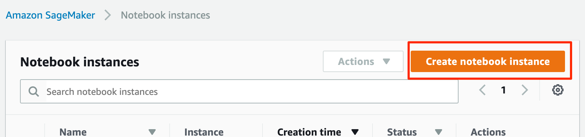
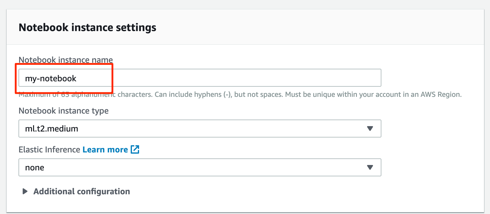
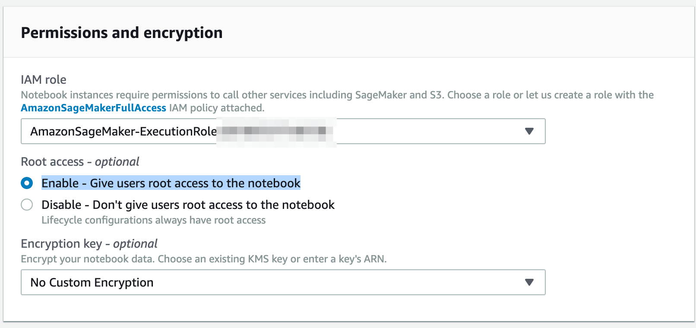
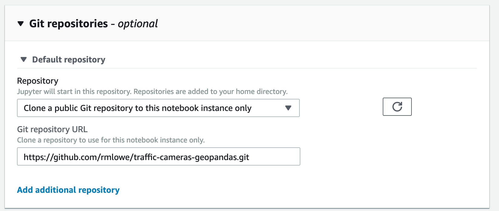
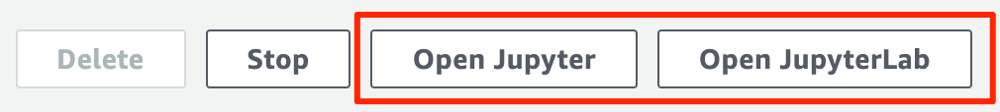

# Plotting traffic camera locations in Hong Kong with GeoPandas

This project contains a [Jupyter notebook](Traffic%20Cameras%20-%20GeoPandas.ipynb) that explains how to use [GeoPandas](http://geopandas.org/) to visualise locations on a map, in this case the locations of traffic cameras in Hong Kong.

The project makes use of traffic camera location data sourced from [here](https://data.gov.hk/en-data/dataset/hk-td-tis_2-traffic-snapshot-images/resource/338f29cd-cefc-49b9-b2d2-2894cb28953f), together with a shapefile of Hong Kong's 18 districts sourced from [here](http://opendata.esrichina.hk/datasets/eea8ff2f12b145f7b33c4eef4f045513_0). (Note that the traffic camera data is from the same dataset I used to create [this](https://rmlowe.github.io/traffic-images/).)

## Using Amazon SageMaker Notebooks

This code will run in any Jupyter environment. I used an Amazon SageMaker Notebook, as described below. Amazon SageMaker is part of AWS, so you will need an AWS account to follow this approach.

Start by navigating to Amazon SageMaker in the AWS console. In the Amazon SageMaker menu, under **Notebook**, select **Notebook instances**.

On the **Notebook instances** page, click **Create notebook instance**.

Under **Notebook instance settings**, give your instance a name.

Under **Permissions and encryption**, if you don't already have a SageMaker role, choose **Create a new role** under **IAM role**. The role defaults should be fine as the notebook doesn't require any special permissions. Under **Root access** select **Enable - Give users root access to the notebook**.

Under **Git repositories**, choose **Clone a public Git repository to this notebook instance only**. Under **Git repository URL**, enter the URL of this repository, which is `https://github.com/rmlowe/traffic-cameras-geopandas.git`.

Alternatively, you could fork this repository, and then [add the forked repository to your Amazon SageMaker account](https://docs.aws.amazon.com/sagemaker/latest/dg/nbi-git-repo.html#nbi-git-resource). That allows you to associate credentials with the repository in SageMaker, so you can push changes back up to the forked repository.

You can leave other settings at their default values, and click **Create notebook instance**.

It might take a few minutes for the instance to start. Once the instance is started, click on the instance name under **Notebook instances**, then click on either **Open Jupyter** or **Open JupyterLab** to access the notebook. (I recommend using JupyterLab since it has out-of-the-box integration with git.)

